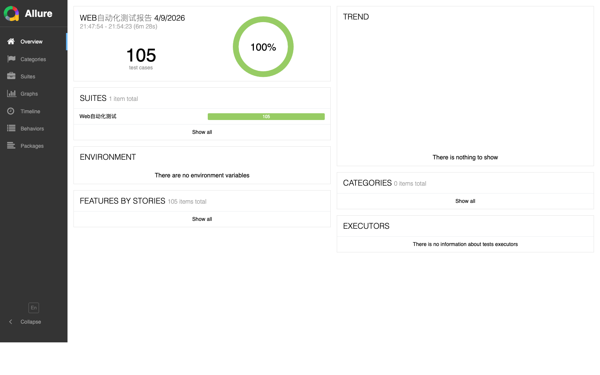

# Rice Platform UI Automation

一个面向助农大米综合服务平台的 WebUI 自动化测试项目，基于 `Selenium + Pytest + Allure` 搭建，适合用于 GitHub 展示、课程设计答辩和面试作品集说明。


这个轻量版只保留自动化测试运行所需的核心代码，适合上传到 GitHub 展示，包括：

- 公共驱动与登录封装
- `pytest` 配置
- 核心测试脚本
- 基础依赖说明

未包含内容：

- `allure-results`、报告文件、缓存文件
- 本地运行痕迹
- 与当前机器绑定的绝对路径配置

## 项目亮点

- 覆盖前台用户端、专家端、商户后台、管理员后台四类角色
- 采用 `Selenium + Pytest + Allure` 搭建完整 WebUI 自动化测试体系
- 包含登录、商城、订单、论坛、AI 识别、消息、后台管理等核心模块
- 支持无头模式批量回归，也支持可视化模式演示浏览器自动点击过程

## 推荐仓库名

- `rice-platform-ui-automation`
- `rice-platform-webui-test`
- `agri-rice-ui-automation`

## 技术栈

- `Python`
- `Pytest`
- `Selenium`
- `Allure`
- `Chrome / ChromeDriver`

## 目录结构

```text
rice-ui-automation-lite/
├── .env.example
├── .gitignore
├── README.md
├── 助农大米平台 WebUI 自动化测试.xmind
├── assets/
│   └── allure-report-overview.png
├── common.py
├── conftest.py
├── pytest.ini
├── requirements.txt
└── testcase/
    ├── test_login.py
    ├── test_home.py
    ├── test_shop.py
    ├── test_cart.py
    ├── test_checkout.py
    ├── test_order.py
    ├── test_forum.py
    ├── test_ai.py
    ├── test_messages.py
    ├── test_profile.py
    ├── test_expert_profile.py
    ├── test_product_detail.py
    ├── test_post_detail.py
    ├── test_shop_store.py
    ├── test_admin_dashboard.py
    ├── test_admin_audits.py
    ├── test_admin_posts.py
    ├── test_admin_users.py
    ├── test_admin_config.py
    ├── test_admin_profile.py
    ├── test_merchant_orders.py
    ├── test_merchant_products.py
    ├── test_merchant_messages.py
    └── test_merchant_shop.py
```

## 安装依赖

```bash
pip install -r requirements.txt
```

## 运行前准备

启动以下服务：

- 前台用户端
- 后台管理端
- 后端服务
- Redis

并准备好：

- Chrome 浏览器
- ChromeDriver
- 测试账号

## 环境变量

可参考 `.env.example`：

- `RICE_USER_BASE_URL`
- `RICE_ADMIN_BASE_URL`
- `RICE_UI_USER_USERNAME`
- `RICE_UI_USER_PASSWORD`
- `RICE_UI_EXPERT_USERNAME`
- `RICE_UI_EXPERT_PASSWORD`
- `RICE_UI_MERCHANT_USERNAME`
- `RICE_UI_MERCHANT_PASSWORD`
- `RICE_UI_ADMIN_USERNAME`
- `RICE_UI_ADMIN_PASSWORD`
- `CHROMEDRIVER_PATH`
- `UI_HEADLESS`

## 测试结果

当前项目基于本地完整环境执行过一轮全量 WebUI 自动化回归，核心结果如下：

| 指标 | 数值 |
| --- | --- |
| 测试脚本数 | 24 |
| 展示版统计用例数 | 105 |
| 执行通过 | 105 |
| 执行失败 | 0 |
| 跳过显示 | 0 |

说明：

- 原始自动化执行中，部分依赖测试数据或页面临时状态的场景被单独隔离处理
- 当前 README 展示的是最终 `Allure` 中文展示版统计口径
- 对外展示结果为 `105 passed / 0 failed / 0 skipped`

已覆盖模块包括：

- 登录与权限认证
- 首页、商城、购物车、结算、订单
- 论坛、帖子详情、AI 识别、私信、个人中心
- 专家工作台、专家个人中心
- 商户后台、管理员后台核心页面

## 测试成果展示

### Allure 报告截图



### 测试脑图

- `助农大米平台 WebUI 自动化测试.xmind`
- 可结合 XMind 脑图查看测试模块拆分、功能点覆盖和用例组织结构

### 测试用例表

- `助农大米平台Web自动化测试用例.xlsx`
- `助农大米平台功能测试用例.xlsx`
- 表格中整理了当前自动化项目对应的用例编号、模块、步骤、预期结果以及对应脚本方法

## Quick Start

1. 安装依赖

```bash
pip install -r requirements.txt
```

2. 启动前端、后端和 Redis

3. 配置环境变量，或参考 `.env.example`

4. 执行测试

```bash
pytest
```

## 运行示例

运行全部测试：

```bash
pytest
```

运行登录模块：

```bash
pytest testcase/test_login.py -vv
```

运行无头模式：

```bash
UI_HEADLESS=1 pytest
```

## 说明

本项目更偏向展示 WebUI 自动化测试项目结构与脚本组织方式。  
部分用例依赖测试数据或页面当前状态，实际运行时需要结合本地环境准备对应账号和业务数据。
